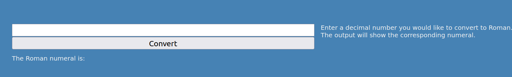

# Roman numeral converter

Live site: [Roman Numerals converter](https://javierdebug.github.io/roman-numerals-converter/)

**Description:**

This webapp can convert decimal number to Roman numeral. It uses modern approach for bigger number as 5000, 10000, 50000 up to 100000, this is helpful because reduce the amount of letters needed for bigger numbers, as thousands and millions.

### Big numerals table:

| Decimal       | Roman  |
|:--------------|:------:|
| 5.000         | V̅      |
| 10.000        | X̅      |
| 50.000        | L̅      |
| 100.000       | C̅      |
| 500.000       | D̅      |
| 1.000.000     | M̅      |

**General view of the main area:**

